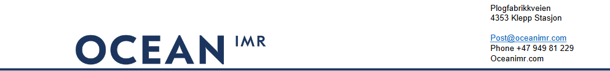
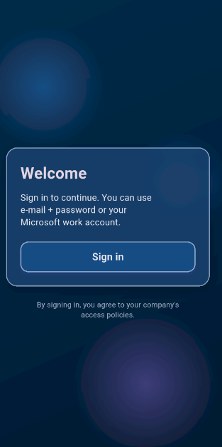
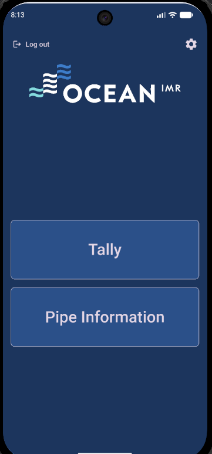
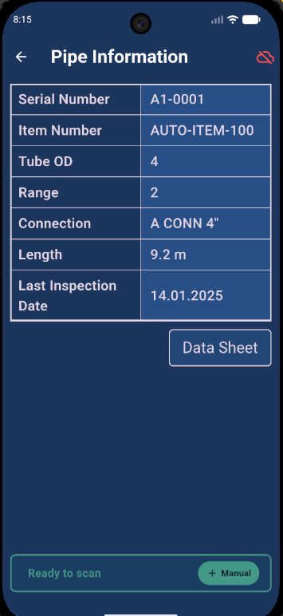
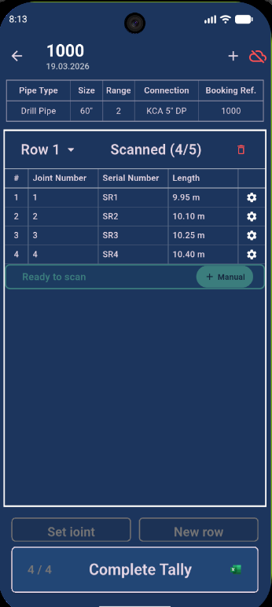

# Ocean Tracer – User Guide

---

## 1. Overview

This app allows you to:
- Scan and manage pipe data  
- Create structured tallies  
- Sync data with the cloud backend  

---

## 2. Getting Started

### Login

When opening the app, you must log in using your company account via Microsoft Entra ID.

**Steps:**
1. Open the app  
2. Sign in with your company credentials  
3. Complete authentication

 
 

---

## 3. Home Screen

After login, you will land on the main screen.

**Available options:**
- **Tally** – Create and manage tallies  
- **Pipe Information** – View pipe data  
- **Settings** – App configuration

 
 

---

## 4. Settings

Open settings from the top corner.

**Options:**
- **Language**  
  Switch between English and Norwegian  

- **Sync**  
  Connects to the backend and enables:
  - Data upload  
  - Data retrieval  
  - Access to pipe documentation  

**Important:**  
If the cloud icon is **green**, the app is connected to the backend.

 
 

---

## 5. Pipe Information

Use this section to retrieve detailed pipe data.

**Steps:**
1. Open **Pipe Information**  
2. Scan or manually enter a pipe  
3. View available data  

**Data Sheet:**
- Press **"Data Sheet"** to open full documentation  
- Requires active sync (connection must be green)

 
 

---

## 6. Tally (Main Function)

This is the primary workflow of the app.

---

### 6.1 Create a Tally

1. Press **Tally**  
2. Enter:
   - Booking reference  
   - First row amount  
3. Confirm to create the tally

 
 

---

### 6.2 Add Pipes to a Row

- Scan pipes to fill the row  
- Continue until the row is complete  

 
 

---

### 6.3 Add a New Row

- After completing a row:
  1. Add a new row  
  2. Set the required row length  

 
 

---

### 6.4 Fix Missing or Incorrect Input

If a pipe is missing or misplaced:
- Press **"Set Joint"**  
- Scan the pipe into the correct position

 
 

---

### 6.5 Manage Tallies

Use the top header to:
- Switch between active tallies  
- Delete a tally  

 
 

---

### 6.6 Manage Rows

Use the row header to:
- Switch between rows  
- Delete a row  

 
 

---

### 6.7 Edit Pipe Data

- Press the gear icon on a pipe row  
- Edit data or add comments

 
 

---

### 6.8 Complete a Tally

1. Press **"Tally Complete"**  
2. An Excel report is generated

 
 

---

## 7. Sync Status (Critical)

Sync status is visible:
- In **Settings**  
- In the **Tally page header**  
- In the **Pipe Information header**  

**Status meaning:**
- 🟢 Green = Connected to backend  
- 🔴 Not connected = Data may not be saved or updated  

---

## 8. Best Practices

- Ensure sync is **green** before:
  - Accessing data sheets  
  - Expecting data to be saved  
- Verify all rows before completing a tally
- Use **Set Joint** to correct mistakes
- A tally cannot be completed until required data is valid

---

