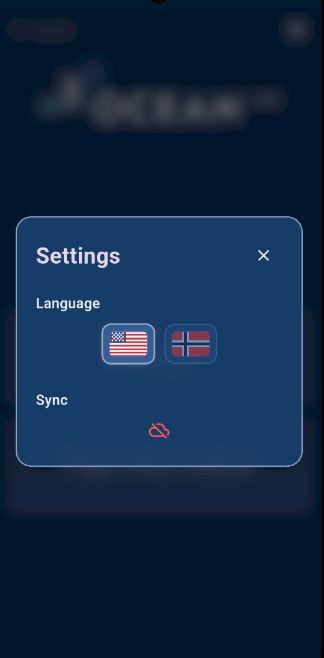
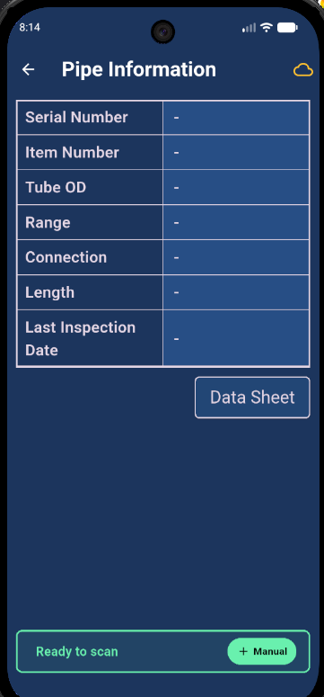
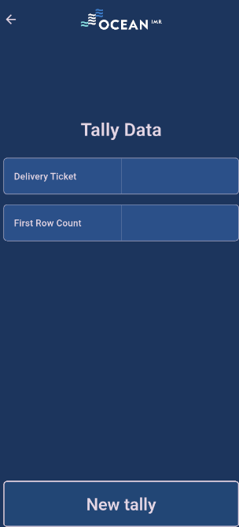
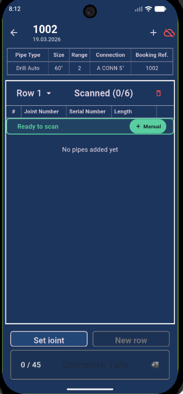

# User Guide – Ocean Tracer

## 1. Overview

This app allows you to:
- Scan and manage pipe data  
- Create and manage tallies  
- Sync data with the cloud  

---

## 2. Getting Started

### 2.1 Login

When opening the app, you’ll be prompted to log in using your company account via Microsoft Entra ID.

**Steps:**
1. Open the app  
2. Enter your company credentials  
3. Complete authentication  

---

## 3. Home Screen

After login, you will land on the main homepage.

**Main elements:**
- Tally (primary function)  
- Pipe Information  
- Settings (top corner)  

---

## 4. Settings

Access settings via the icon in the top corner.

**Options:**
- **Language** – Toggle between English and Norwegian  
- **Sync** – Connects to backend and enables:
  - Data upload  
  - Data retrieval  
  - Access to pipe documentation  

**Important:**  
If the sync/cloud icon is green, you are connected to the cloud.

---

## 5. Pipe Information

Used to retrieve pipe-specific data.

**How to use:**
1. Navigate to *Pipe Information*  
2. Scan or manually add a pipe  
3. View pipe details  

**Data Sheet Access:**
- Press **“Data Sheet”** to open full documentation  
- Requires backend connection (sync must be ON)  

---

## 6. Tally (Main Functionality)

This is the core feature of the app.

---

### 6.1 Create a Tally

1. Press **Tally**  
2. Enter:
   - Booking reference  
   - First row amount  

---

### 6.2 Add Pipes to a Row

- Scan pipes to fill the row  
- Continue until the row is complete  

---

### 6.3 Add a New Row

- After completing a row:
  - Add a new row  
  - Set row length  

---

### 6.4 Fix Missing Inputs

If something is missing:
- Use **“Set Joint”**  
- Scan pipe into the correct position  

---

### 6.5 Manage Tallies

- Use the top header to:
  - Switch between tallies  
  - Delete tallies  

---

### 6.6 Manage Rows

- In the row header:
  - Switch between rows  
  - Delete rows  

---

### 6.7 Edit Pipe Data

- Press the gear icon on a pipe row  
- Add comments or edit data  

---

### 6.8 Complete a Tally

- Press **“Tally Complete”**  
- The system generates an Excel report  

---

## 7. Sync Status (Critical)

Sync status is visible:
- In Settings  
- In the Tally page header  
- In the Pipe Information header  

**Status meaning:**
- Green = Connected to cloud  
- Yellow / Red = Not connected, app data might be outdated.

---

## 8. Best Practices

- Always ensure sync is green before accessing data sheet
- Double-check row input before completing  
- Use **Set Joint** instead of guessing placements  
- User cannot complete a tally until data is fully verified  